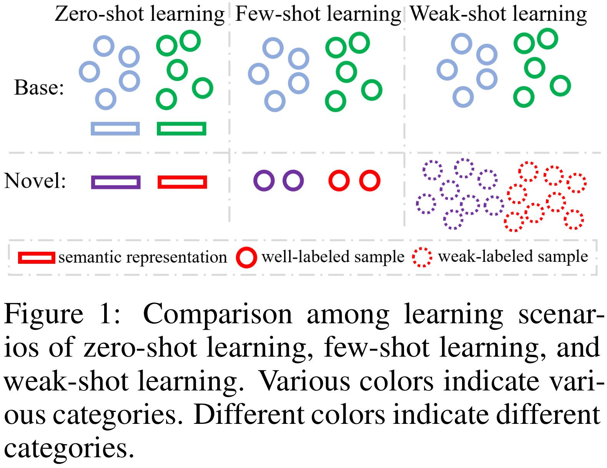
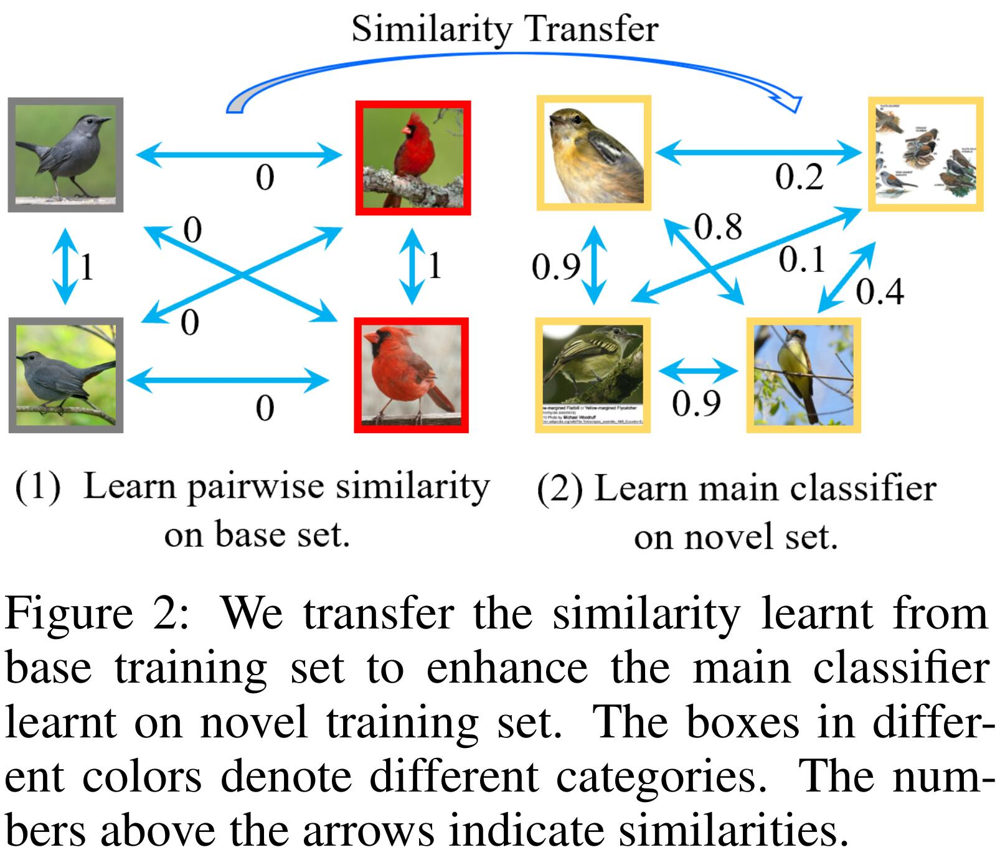
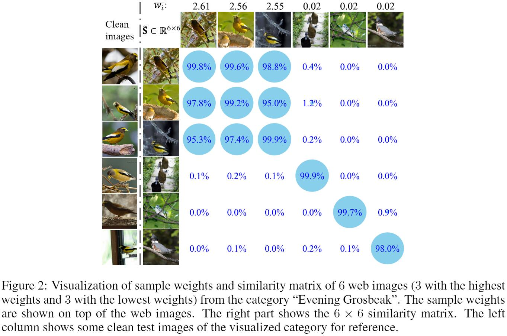

# SimTrans-Weak-Shot-Classification

This repository contains the official PyTorch implementation of the following paper:

> **Weak-shot Fine-grained Classification via Similarity Transfer**<br>
>
> Junjie Chen, [Li Niu](http://bcmi.sjtu.edu.cn/home/niuli/), Liu Liu, Liqing Zhang<br>MoE Key Lab of Artificial Intelligence, Shanghai Jiao Tong University<br>
> https://arxiv.org/abs/2009.09197 <br> Accepted by **NeurIPS2021**.

## Abstract
Recognizing fine-grained categories remains a challenging task, due to the subtle distinctions among different subordinate categories, which results in the need of abundant annotated samples.
To alleviate the data-hungry problem, we consider the problem of learning novel categories from web data with the support of a clean set of base categories, which is referred to as weak-shot learning.
In this setting, we propose to transfer pairwise semantic similarity from base categories to novel categories.
Specifically, we firstly train a similarity net on clean data, and then leverage the transferred similarity to denoise web training data using two simple yet effective strategies.
In addition, we apply adversarial loss on similarity net to enhance the transferability of similarity. 
Comprehensive experiments on three fine-grained datasets demonstrate the effectiveness of our setting and method.

## 1. Setting
<div align="center">
  
</div>

In practice, we often have a set of base categories with sufficient well-labeled data, and the problem is how to learn novel categories with less expense, in which base categories and novel categories have no overlap.
Such problem motivates zero-shot learning, few-shot learning, as well as our setting.
To bridge the gap between base categories and novel categories, zero-shot learning requires category-level semantic representation for all categories, while few-shot learning requires a few clean examples for novel categories.
Considering the drawbacks of zero/few-shot learning and the accessibility of free web data, we intend to learn novel categories by virtue of web data with the support of a clean set of base categories.

## 2. Our Method
<div align="center">
  
</div>

Specifically, our framework consists of two training phases.
Firstly, we train a similarity net (SimNet) on base training set, which feeds in two images and outputs the semantic similarity. 
Secondly, we apply the trained SimNet to obtain the semantic similarities among web images.
In this way, the similarity is transferred from base categories to novel categories. Based on the transferred similarities, we design two simple yet effective methods to assist in learning the main classifier on novel training set. (1) Sample weighting (i.e., assign small weights to the images dissimilar to others) reduces the impact of outliers (web images with incorrect labels) and thus alleviates the problem of noise overfitting. (2) Graph regularization (i.e., pull close the features of semantically similar samples) prevents the feature space from being disturbed by noisy labels.
In addition, we propose to apply adversarial loss on SimNet to make it indistinguishable for base categories and novel categories, so that the transferability of similarity is strengthened.

## 3. Results
<div align="center">
  
</div>
Extensive experiments on three fine-grained datasets have demonstrated the potential of our learning scenario and the effectiveness of our method.
For qualitative analysis, on the one hand, the clean images are assigned with high weights, while the images belonging to outlier are assigned with low weights; on the other hand, the transferred similarities accurately portray the semantic relations among web images.


## 4. Experiment Codebase

### 4.1 Data
We provide the packages of CUB, Car, FGVC, and WebVision at [Baidu Cloud](https://pan.baidu.com/s/1Zz-3DBdk_XRYjydApABQoQ) (access code: BCMI). 

The original packages are split by `split -b 10G ../CUB.zip CUB.zip.`, thus we need merge by `cat CUB.zip.a* > CUB.zip` before decompression.

The ImageNet dataset is publicly available, and all data files are configured as:

  ```
  ├── CUB
  ├── Car
  ├── Air
  ├── WebVision
  ├── ImageNet:
    ├── train
        ├── ……
    ├── val
        ├── ……
    ├── ILSVRC2012_validation_ground_truth.txt
    ├── meta.mat
    ├── train_files.txt
  ```


Just employ `--data_path ANY_PATH/CUB` to specify the data dir.

### 4.2 Install 
See `requirement.txt`.

The proposed approach is implemented in Python 3.7.4 and Pytorch 1.0.1, on Ubuntu 18.04 with 32 GB Intel 9700K CPU and two NVIDIA 2080ti GPUs.

### 4.3 Evaluation
The trained models are released as `trained_models.zip` at [Baidu Cloud](https://pan.baidu.com/s/1Zz-3DBdk_XRYjydApABQoQ) (access code: BCMI).

The command in `_scripts/DATASET_NAME/eval.sh` is used to evaluate the model.

### 4.4 Training
We provide the full scripts for CUB dataset in `_scripts/CUB/` dir as an example.

For other datasets, just change the data path, i.e., `--data_path ANY_PATH/WebVision`.


## Bibtex
If you find this work is useful for your research, please cite our paper using the following **BibTeX  [[pdf]()] [[supp]()] [[arxiv](https://arxiv.org/abs/2009.09197)]:**

```
@inproceedings{SimTrans2021,
title={Weak-shot Fine-grained Classification via Similarity Transfer},
author={Chen, Junjie and Niu, Li and Liu, Liu and Zhang, Liqing},
booktitle={NeurIPS},
year={2021}}
```

